# Hangman
Having a neck is something that most people will have in common. Personally, I like my neck intact. Welcome to the exciting game of Hangman! In this game, your linguistic skills will be put to the ultimate test. Hangman is a challenging experience that combines the thrill of word puzzles with the suspense of saving a life. The objective is simple yet thrilling: guess the hidden word by suggesting letters one at a time.

 But be warned, for every incorrect guess, another piece of the hangman will be assembled. With a limited number of attempts, your mental agility and vocabulary prowess will determine whether the innocent stick figure survives or meets an unfortunate demise. Can you unravel the word and emerge as the hero of this gripping tale? The stage is set, so let the guessing begin!

The live project can be accessed [here](https://hangman-md-95d75375f313.herokuapp.com/)

    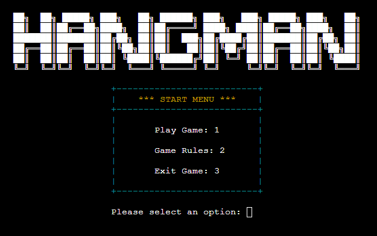

## UI/UX

### Design Overview
The game was ultimately designed to be interesting to look at as well as intuitive. All of the menus are clearly laid out with enough information to help a first time user to navigate through them with ease. The game provides input validation to assist the user in entering the correct data for the program to function correctly and is also designed to run continuously until the user decides to exit.

### Colour Scheme
[Colorama](https://pypi.org/project/colorama/) was used to apply colour to the text in the terminal. Colours were used to make the program more visually appealing more to give innate meanings to particular sections of the code.

**Colours Used**
- Inputs are displayed in white, this is due to white having the least confict and is easy to read.
- Menu borders are displayed in Cyan.
- Menu headings are displayed in Yellow.
- Errors are displayed in Red.
- Difficulty settings are displayed in Green (Easy), Yellow (Medium) and Red (Hard).
- Green and Red are used for win and loss case text.
- The revealed hidden word is displayed in Yellow at the end of the game.

## User Stories

1. As a new site user, I'd like to understand the site's goal so that I can determine whether I would like to use it or not.
2. As a new site user, I'd like to understand how to play the game.
3. As a new site user, I'd like the navigation to be simple and easy to understand.
4. As a new site user, I'd like to easily understand what input is needed on each step.
5. As a new site user, I'd like the game to test my knowledge and give me feedback on my progress.

## Flowchart

During the planning stages of this project, [Smartdraw](https://cloud.smartdraw.com/) was used to design the below flochart in order to plan the logic of program.

Throughout the development of the project, some new functions and display cases have been added; however, the base game functionality/logic has stayed quite similar to the initial idea.

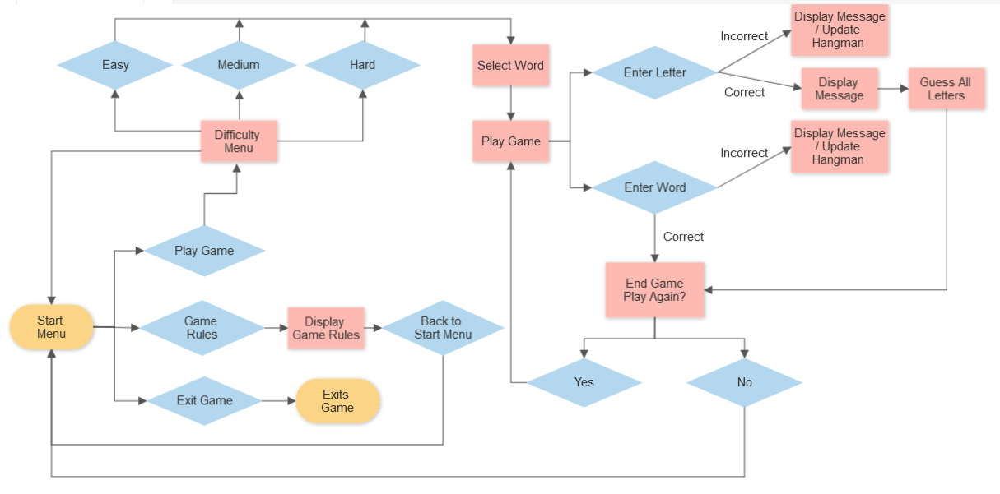

## Features

### Main Logo

The main game logo is displayed on the start menu and difficulty selection menus. The logo was created with a [Text to ASCII Art](https://patorjk.com/software/taag/) generator. The logo itself is meaningful and intersting to look at. It further demonstrates what the program is about.
    

    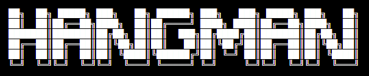

### Start Menu

The start menu consists of 3 separate options, and, prompts the user to enter information. Each option has a corresponding number. The numbers are what the user needs to enter to access these features in the program. In the event that the user enters invalid information, an error message will appear prompting them for the correct information.

The 'Play Game' option will bring the user to the difficulty menu, the 'Game Rules' option will bring the user to the rules menu and the 'Exit Game' option will simply end the program and display a message showing the user that they have now exited the game.

    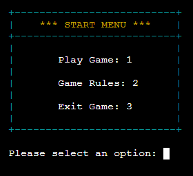

### Rules Menu

If the user enters 2 in the start menu selection, the rules menu will display. This menu explains in detail how to play the game of hangman and how the different difficultys work. The user will also be prompted to press 'Enter' to return to the start menu. Again, in the event that the user does not enter the correct information, the program will display an error message telling them that their input is invalid.

    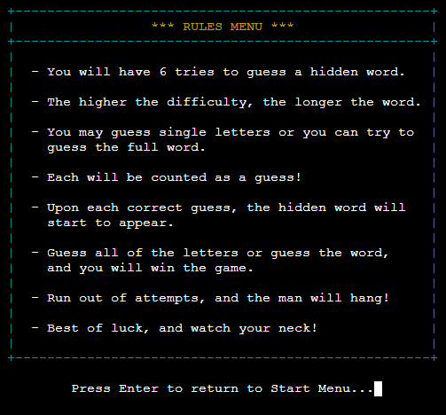

### Difficulty Menu

Once the user selects 'Play Game' on the start menu, they will be shown this menu below. This is the difficulty menu. It displays each of the selectable difficulties of the game. There is also an option that allows the user to go back to the start menu. Depending on the difficulty selected by the user, the length of the hidden word will change. 

When playing on easy, words of length 3-4 are displayed. When playing on medium difficulty, words of length 5-6 are displayed. When playing on hard difficulty, words of length 7 and above are displayed Similar to the previous menus, if the user enters data that is invalid, an error message will be shown pointing them in the right direction.

    

### Main Game Screen

The main game screen displays all of the game information to the user. This includes the hangman's gallows, what letters have been guessed, what words have been guessed and a prompt to the user to enter a word or letter. Again, when the user enters an invalid input, a error message will be shown.

    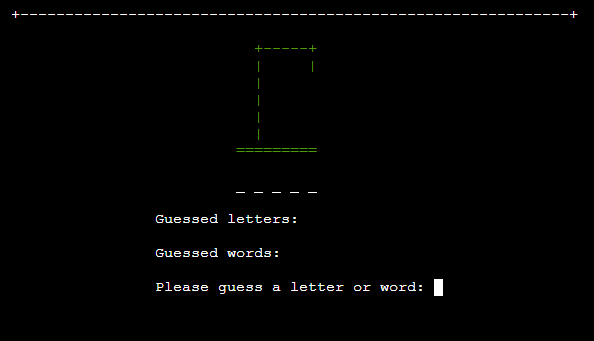

### Constantly Updating Hangman Stages

The individual stages of the hangman will constantly update depending on the inputs of the user. If the user enters a correct letter, the hangman stage will stay the same, if they enter a letter or word that is incorrect, it will update and show the next stage. Throughout the guessing process, 

The further along the hangman stage is, the colour of the hangman will also start to change. The first three stages are 'Green', the next two are 'Yellow' and the last stage before the game ends, is 'Red'. This signifies to the user that they are running out of guesses.

    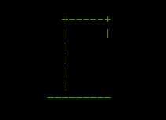
    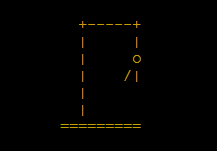
    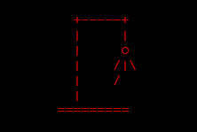

### Revealing Hidden Word

As the user guesses letters, the hidden word will update in accordance with all correct letters guessed by the player. When the user guesses a correct letter, the underscore in the position of that letter will be replaced with the selected letter. For example, if the user guesses 'I', and it is in the chosen word, it will be replaced like the example below.

    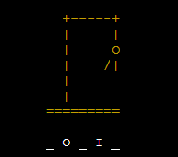

### Tracking Guessed Words & Letters

Throughout the guessing process, each guessed word and letter will be tracked and added to the 'Guessed Letters' and 'Guessed Words' sets. These sets will update and display the information to the user upon guessing. This is to show the user what they have already guessed so that they do not need to enter it again. In the event that the user enters the same letter or word twice, a message will appear explaining that they have already guessed that particular letter or word.

    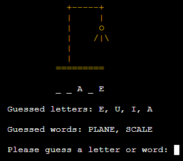

### Guess Feedback

Upon each guess, the program will output specific messages based on what the user has input. These include; telling the user if their guess is or is not in the word, if they have aready guessed a particular word or letter or if their guess is invalid. Invalid guesses can be caused by entering a number or a word with a different length than the chosen word.

    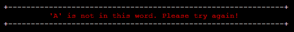
    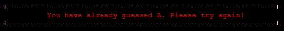
    
    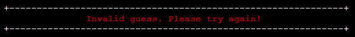

### Game Over Screen

The game over screen will display to the user if they have run out of attempts or if they correctly guessed the word. If the user loses the game, the game over text will be red, 'YOU LOSE' text will appear, and the hidden word will be revealed in yellow. If the user wins the game, the game over text will be green, 'YOU WIN' will appear, and again, the hidden word will be revealed in yellow.

    
    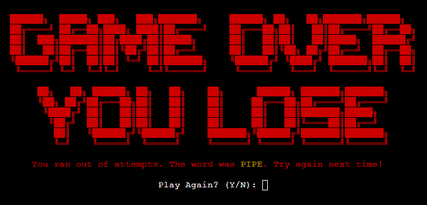

### Replay Feature

On the game over screen, the user in prompted for input asking if they would like to play the game again. If they play again by entering 'Y', the program will restart the game at the chosen difficulty with a new word to guess.

If the user does not want to play again by entering 'N', they will be returned to the start menu, where they can select a new difficulty. The prevents the need for reloading the program to play again! if the user enters an invalid input, an error message will appear.

    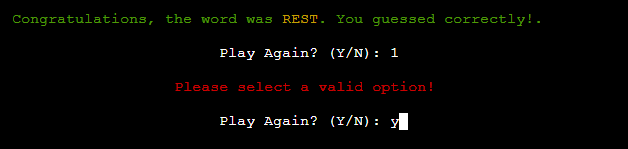

