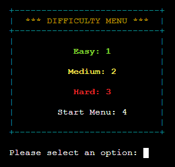
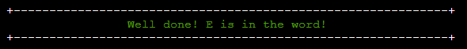
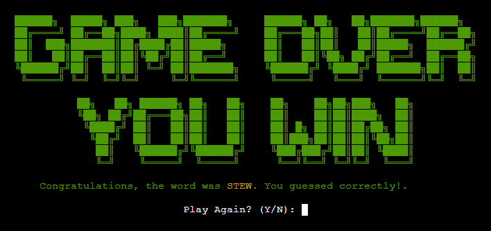
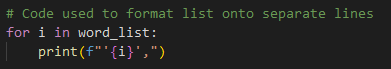

# Hangman
Having a neck is something that most people will have in common. Personally, I like my neck intact. Welcome to the exciting game of Hangman! In this game, your linguistic skills will be put to the ultimate test. Hangman is a challenging experience that combines the thrill of word puzzles with the suspense of saving a life. The objective is simple yet thrilling: guess the hidden word by suggesting letters one at a time.

 But be warned, for every incorrect guess, another piece of the hangman will be assembled. With a limited number of attempts, your mental agility and vocabulary prowess will determine whether the innocent stick figure survives or meets an unfortunate demise. Can you unravel the word and emerge as the hero of this gripping tale? The stage is set, so let the guessing begin!

The live project can be accessed [here](https://hangman-md-95d75375f313.herokuapp.com/)

    

## Index – Table of Contents

* [UI/UX](#UIUX)
* [User Stories](#user-stories)
* [Flowchart](#Flowchart)
* [Features](#features)
* [Technologies Used](#technologies-used)
* [Testing](#testing)
* [Bug Fixes](#bug-fixes)
* [Known Bugs](#known-bugs)
* [Deployment](#deployment)
* [Credits](#credits)
* [Acknowledgements](#acknowledgements)

## UI/UX

### Design Overview
The game was ultimately designed to be interesting to look at as well as intuitive. All of the menus are clearly laid out with enough information to help a first time user to navigate through them with ease. The game provides input validation to assist the user in entering the correct data for the program to function correctly and is also designed to run continuously until the user decides to exit.

### Colour Scheme
[Colorama](https://pypi.org/project/colorama/) was used to apply colour to the text in the terminal. Colours were used to make the program more visually appealing more to give innate meanings to particular sections of the code.

**Colours Used**
- Inputs are displayed in white; this is due to white having the least conflict and is easy to read.
- Menu borders are displayed in Cyan.
- Menu headings are displayed in Yellow.
- Errors are displayed in Red.
- Difficulty settings are displayed in Green (Easy), Yellow (Medium) and Red (Hard).
- Green and Red are used for win and loss case text.
- The revealed hidden word is displayed in Yellow at the end of the game.

## User Stories

1. As a new site user, I'd like to understand the site's goal so that I can determine whether I would like to use it or not.
2. As a new site user, I'd like to understand how to play the game.
3. As a new site user, I'd like the navigation to be simple and easy to understand.
4. As a new site user, I'd like to easily understand what input is needed on each step.
5. As a new site user, I'd like the game to test my knowledge and give me feedback on my progress.

    [Validating User Stories](#validating-user-stories)

## Flowchart

During the planning stages of this project, [Smartdraw](https://cloud.smartdraw.com/) was used to design the below flowchart in order to plan the logic of program.

Throughout the development of the project, some new functions and display cases have been added; however, the base game functionality/logic has stayed quite similar to the initial idea.

## Features

### Main Logo

The main game logo is displayed on the start menu and difficulty selection menus. The logo was created with a [Text to ASCII Art](https://patorjk.com/software/taag/) generator. The logo itself is meaningful and intersting to look at. It further demonstrates what the program is about.
    

    

### Start Menu

The start menu consists of 3 separate options, and, prompts the user to enter information. Each option has a corresponding number. The numbers are what the user needs to enter to access these features in the program. In the event that the user enters invalid information, an error message will appear prompting them for the correct information.

The 'Play Game' option will bring the user to the difficulty menu, the 'Game Rules' option will bring the user to the rules menu and the 'Exit Game' option will simply end the program and display a message showing the user that they have now exited the game.

    

### Rules Menu

If the user enters 2 in the start menu selection, the rules menu will display. This menu explains in detail how to play the game of hangman and how the different difficulties work. The user will also be prompted to press 'Enter' to return to the start menu. Again, in the event that the user does not enter the correct information, the program will display an error message telling them that their input is invalid.

    

### Difficulty Menu

Once the user selects 'Play Game' on the start menu, they will be shown this menu below. This is the difficulty menu. It displays each of the selectable difficulties of the game. There is also an option that allows the user to go back to the start menu. Depending on the difficulty selected by the user, the length of the hidden word will change. 

When playing on easy, words of length 3-4 are displayed. When playing on medium difficulty, words of length 5-6 are displayed. When playing on hard difficulty, words of length 7 and above are displayed Similar to the previous menus, if the user enters data that is invalid, an error message will be shown pointing them in the right direction.

    

### Main Game Screen

The main game screen displays all of the game information to the user. This includes the hangman's gallows, what letters have been guessed, what words have been guessed and a prompt to the user to enter a word or letter. Again, when the user enters an invalid input, a error message will be shown.

    

### Constantly Updating Hangman Stages

The individual stages of the hangman will constantly update depending on the inputs of the user. If the user enters a correct letter, the hangman stage will stay the same, if they enter a letter or word that is incorrect, it will update and show the next stage. Throughout the guessing process, 

The further along the hangman stage is, the colour of the hangman will also start to change. The first three stages are 'Green', the next two are 'Yellow' and the last stage before the game ends, is 'Red'. This signifies to the user that they are running out of guesses.

    
    
    

### Revealing Hidden Word

As the user guesses letters, the hidden word will update in accordance with all correct letters guessed by the player. When the user guesses a correct letter, the underscore in the position of that letter will be replaced with the selected letter. For example, if the user guesses 'I', and it is in the chosen word, it will be replaced like the example below.

    

### Tracking Guessed Words & Letters

Throughout the guessing process, each guessed word and letter will be tracked and added to the 'Guessed Letters' and 'Guessed Words' sets. These sets will update and display the information to the user upon guessing. This is to show the user what they have already guessed so that they do not need to enter it again. In the event that the user enters the same letter or word twice, a message will appear explaining that they have already guessed that particular letter or word.

    

### Guess Feedback

Upon each guess, the program will output specific messages based on what the user has input. These include; telling the user if their guess is or is not in the word, if they have already guessed a particular word or letter or if their guess is invalid. Invalid guesses can be caused by entering a number or a word with a different length than the chosen word.

    
    
    
    

### Game Over Screen

The game over screen will display to the user if they have run out of attempts or if they correctly guessed the word. If the user loses the game, the game over text will be red, 'YOU LOSE' text will appear, and the hidden word will be revealed in yellow. If the user wins the game, the game over text will be green, 'YOU WIN' will appear, and again, the hidden word will be revealed in yellow.

    
    

### Replay Feature

On the game over screen, the user in prompted for input asking if they would like to play the game again. If they play again by entering 'Y', the program will restart the game at the chosen difficulty with a new word to guess.

If the user does not want to play again by entering 'N', they will be returned to the start menu, where they can select a new difficulty. The prevents the need for reloading the program to play again! if the user enters an invalid input, an error message will appear.

    

## Future Features

### Score system

- A future feature I would be keen to add is a score system. For each correctly guessed letter, the player could gain a set amount of score, for example, 25 points. If they guessed the word at the end of the game, they could gain 100 points. If a user guesses the full word, they could receive even more bonus points as it is the hardest to accomplish. The harder the difficulty, the more points you gain. The users total points will be displayed at the end of the game.

### Storing The User Score

- Another feature that I would like to add in addition to the user score, is a way to store the score. This way the user could keep track of their own score and try to beat their records. This could also be implemented for other users to keep track of all scores recieved on the game. This would allow users to compete against each other to achieve the highest score.

### Adding a Timer

- Another interesting feature I would like to add is a timer. A timer adds a sense of urgency and challenge to the game. Players will need to make their guesses within a limited time frame, which can increase the excitement and engagement. That said, players will need to be provided with sufficient time to make their guesses, considering the complexity of the words and the difficulty of the game. The timer duration will be adjusted with each difficulty accordingly to ensure a fair and enjoyable experience for players.

## Technologies Used

- [Python3](https://en.wikipedia.org/wiki/Python_(programming_language)) was used to create all game content and logic.
- [Random](https://docs.python.org/3/library/random.html) python library used to select a random word from a list.
- [OS](https://docs.python.org/3/library/os.html) python library used to clear the terminal.
- [Colorama](https://pypi.org/project/colorama/) used to apply colour to all terminal text.
- [Git](https://www.atlassian.com/git/tutorials/what-is-git) used for version control.
- [GitHub](https://github.com/) used to store game source code.
- [GitPod](https://gitpod.io/) used as a cloud-based IDE for developing the game.
- [Heroku](https://id.heroku.com/) used to deploy the project.
- [Smartdraw](https://cloud.smartdraw.com/) used to create program flowchart.

## Testing

### Code Validation

[CI Python Linter](https://pep8ci.herokuapp.com/#) was used to validate the python code. More info about the code validation process can be seen in the [Bug Fixes](#bug-fixes) section of the README.

    
    

### Browser Compatibility

The site has been tested on the following browsers:
- Google Chrome - ✔️
- Mozilla FireFox - ✔️
- Microsoft Edge - ✔️
- iOS (Mobile) - ❌
- Android - ❌

Through testing, mobile browsers are not Compatible and will not run the program correctly.

### Validating User Stories

[Back to User Stories](#user-stories)

| Story No. | Feature Developed | Criteria Met 
|--|--|--|
| 1 | The start menu clearly outlines the sites purpose in the main heading. In the event that the user does not know what 'Hangman' is, the 'Play Game' option immediately signifies to the user that this program is a game allowing them to decide whether they would like to use it or not. | Pass | 
| 2 | Rules menu developed to explain to the user exactly how to play the game. | Pass | 
| 3 | All options are clearly labelled and have descriptive names. If the user enters invalid information, error messages will be shown pointing them in the right direction. Navigation is built to be intuitive and easy to understand. | Pass | 
| 4 | Each input message is clear and descriptive when prompting the user for information. Again, there are error messages in case users enter incorrect information.  | Pass | 
| 5 | The game is built with varying levels of difficulty which will test the players knowledge indefinitely. Feedback is presented in the form of the custom messages, tracking guesses and updating game stages. | Pass | 

### Testing and Results

#### **Start Menu**

| Item | Test | Expected Outcome | Result | 
|--|--|--|--|
| Program Text | Initial Startup | All text and colours load and are shown | pass
| Play Game Option | Enter '1' | Clears terminal & displays difficulty menu | pass
| Game Rules Option | Enter '2' | Clears terminal & displays rules menu | pass
| Exit Game Option | Enter '3' | Exits program & displays exit message | pass
| Invalid Number | Enter '4' | Display error message to choose a valid option | pass
| Validate String Input | Enter string | Display error message to choose a number | pass
| Validate Whitespace Input | Enter whitespace | Display error message to choose a number | pass
| Validate Empty Input | Press 'Enter' | Display error message to choose a number | pass

#### **Rules Menu**

| Item | Test | Expected Outcome | Result | 
|--|--|--|--|
| Rules | Enter Rules Menu | All rule text and colours are displayed and can be seen clearly | pass
| Rules Input | Press 'Enter' | Display start menu | pass
| Validate int input | Enter int | Display invalid input message | pass
| Validate String Input | Enter string | Display invalid input message | pass
| Validate Whitespace Input | Enter whitespace | Display invalid input message | pass

#### **Difficulty Menu**

| Item | Test | Expected Outcome | Result | 
|--|--|--|--|
| Menu | Select 'Play Game' | All text and colours are displayed and can be seen clearly | pass
| Easy Difficulty Option | Enter '1' | Hidden Words of length 3-4 are displayed | pass
| Medium Difficulty Option | Enter '2' | Hidden Words of length 5-6 are displayed | pass
| Hard Difficulty Option | Enter '3' | Hidden Words of length 7-8 are displayed | pass
| Start Menu Option | Enter '4' | Hides the difficulty selection menu and shows the ready up menu | pass
| Invalid Number | Enter '5' | Display error message to choose a valid option | pass
| Validate String Input | Enter string | Display error message to choose a number | pass
| Validate Whitespace Input | Enter whitespace | Display error message to choose a number | pass
| Validate Empty Input | Press 'Enter' | Display error message to choose a number | pass

#### **Main Game Screen**

| Item | Test | Expected Outcome | Result | 
|--|--|--|--|
| Game Elements | Select difficulty | All text and colours load and are shown clearly | pass
| Hangman Stages | Enter Incorrect Input | Stages update correctly | pass
| Hangman Stages | Enter Correct Input | Stages do not update | pass
| Hangman Stages | Enter Same Input | Stages do not update | pass
| Hangman Stages | Enter Input | Stage colours change | pass
| Hidden Word | Start Game | Correct length word displayed | pass
| Hidden Word | Start Game | Word displayed as underscores | pass
| Hidden Word | Guess correct letter | Corresponding underscore in hidden word replaced with guessed letter | pass

**Guessed Variable Tracking**

| Item | Test | Expected Outcome | Result | 
|--|--|--|--|
| Letter Tracking | Guess single letter | Guessed letter set updates & correctly displays guessed letters | pass
| Letter Feedback | Guess correct letter | Correct letter message displayed | pass
| Letter Feedback | Guess incorrect letter | Incorrect letter message displayed | pass
| Letter Feedback | Guess same letter | Same letter message displayed & Letter not added to set twice | pass
| Word Tracking | Guess full word | Guessed word set updates & correctly displays guessed words | pass
| Word Feedback | Guess correct word | Correct word message displayed | pass
| Word Feedback | Guess incorrect word | Incorrect word message displayed | pass
| Word Feedback | Guess same word | Same word message displayed & word not added to set twice | pass

**Main Game Input Validation**

| Item | Test | Expected Outcome | Result | 
|--|--|--|--|
| Validate int input | Enter int | Display invalid input message | pass
| Validate incorrect string length | Enter string | Display invalid input message | pass
| Validate Whitespace Input | Enter whitespace | Display invalid input message | pass
| Validate Empty Input | Press 'Enter' | Display invalid input message | pass

#### **End Game Screen**

| Item | Test | Expected Outcome | Result | 
|--|--|--|--|
| End Screen Elements | Complete Game | All text and colours load and are shown clearly | pass
| Hidden Word | Complete Game | Hidden word revealed in yellow text | pass
| Win Case | Guess Correct Word | End game text displayed in 'Green' | pass
| Win Case | Guess Correct Word | Win case messages displayed | pass
| Loss Case | Run out of attempts | End game text displayed in 'Red' | pass
| Loss Case | Run out of attempts | Loss case messages displayed | pass
| Replay Feature | Complete Game | User prompted for input | pass
| Replay Feature | Enter 'Y' | Quiz restarts at same difficulty | pass
| Replay Feature | Enter 'N' | Start Menu displayed | pass
| Replay Quiz Button | Click button | Restarts the quiz at the chosen difficulty | pass
| Validate int input | Enter int | Display invalid input message | pass
| Validate incorrect string | Enter string | Display invalid input message | pass
| Validate Whitespace Input | Enter whitespace | Display invalid input message | pass
| Validate Empty Input | Press 'Enter' | Display invalid input message | pass

## Bug Fixes

### Validation Issues

When inputting the code into the python linter, there was a plethora of errors, most being an easy fix such as trailing whitespace and expectation of blank lines. That said, there were multiple `E501` errors detailing each line of code that was too long.

This led to a full redesign of all graphical outputs within the program. This was an personal oversight and learning experience on my end. To comply with PEP8 standards, I used a center-print() function to add spaces to the beginning of strings without having to add extra characters. I also assigned each colour tag to shorter variables to save space.

These additions, along with use of docstrings allowed me to redesign the menus, text elements and ASCII art in compliance with PEP8 standards. This is something that will not be overlooked in the future. Below is the center-print() function and colour variables used to solve these issues.

    
    
    

### Replacing Letters In Hidden Word

The idea of adding spaces between the hidden word underscores is the clearly show how many letters are in the word. When implementing spaces in-between the hidden word, there was a bug that caused some of the underscores to not get replaced. When guessing the entire word, the underscores that should correspond to correctly guessed letters are not being replaced. 

By multiplying the index by 2, we can account for the additional spaces between the underscores in the hidden word. This way, when a correct letter is guessed, the corresponding underscore and space will be replaced by the letter. Implementing this fix solved the issue and the underscores were being replaced correctly

**Bug**

    

**Fixed Code**

    

### Words List Format

When the words list was first imported, there was over 1000+ words on a single line. Instead of formatting them manually, I wrote two loops. The first loop printed all list elements in the correct format on separate lines. The list contained some invalid words such as words with dashes in-between or words with spaces. The second loop found each of these invalid words which allowed for them to be removed quickly.

**Initial List**

    

**Format Loop**

    

**Invalid Words Loop**

    

### Hidden Word Not Updating

Throughout the testing process, I uncovered two very specific bugs. The first bug caused the hidden word to not update after replaying the same difficulty quiz twice. If you play the game and decide to play again, the game will choose a different word for you to guess. If you replayed that same quiz again, without restarting, the hidden word would stay the same for all replays after that point. 

After some investigation, I found that the issue was caused due to the word selection function being called outside of the while loop in the `end_game()` function. This caused the word to not reset after the second replay. 

**Bugged Code**

    

**Fixed Code**

    

### Difficulty Not Resetting

The second bug caused the difficulty to not reset when going back to the main menu after finishing the game. If the player decides to play the game again and choose a new difficulty, the newly selected difficulty will only take effect after they have replayed the same game. Looking back through the code I knew there was an issue when the player chooses to go back to the start menu.

I found that when not replaying the game, the `start_menu()` and `play_game()` functions were called. This completely skipped the `select_word(chosen_list)` function which only updated after the second playing of the game. The fix for this was to call the main function within the end game function to ensure that all parts of the program were executed correctly updating the difficulty thus showing the correct word length.

**Bugged Code**

    

**Fixed Code**

    

## Known Bugs

There are currently no known bugs or issues with this program.

## Deployment

The program was deployed using [Heroku](https://id.heroku.com/) by following these steps:

- Create the **requirements.txt** file specifying what python packages are required to work the project and run: `pip3 freeze > requirements.txt` in the terminal.
- Commit changes and push them to **GitHub**.
- Go to the **Heroku's website**.
- From the Heroku dashboard, click on **Create new app**.
- Enter the "App name" and **Choose a region** before clicking on "Create app".
- Go to **Config Vars** under the "Settings" tab.
- Click on **Reveals Config Vars** and add the KEY: CREDS and the VALUE stored in creds.json file if needed.
- Add the Config Var, **KEY: PORT and VALUE: 8000**.
- Go to **Buildpacks** section and click "Add buildpack".
- Select `python` and click "Save changes"
- Add `nodejs` buildpack as well using the same process.
- Go to **Deployment method**, under the "Deploy" tab select "GitHub" and click on **Connect to GitHub**.
- Go to "Connect to GitHub" section and **Search the Repository** to be deployed.
- Click **Connect** next the repository name.
- Choose **Automatic deploys** or **Manual deploys** to deploy your application.

## Credits

| Source | Item | Notes |
| --- | --- | --- |
| [Chris Horton](https://gist.github.com/chrishorton/8510732aa9a80a03c829b09f12e20d9c) | Hangman ASCII Art | Inspiration for hangman ASCII art |
| [Tech With Tim](https://www.youtube.com/watch?v=u51Zjlnui4Y) | Colorama | Understanding Colorama |
| [CBT Nuggets](https://www.youtube.com/watch?v=JNXmCOumNw0&t) | Game Design | Inspiration on games design |
| [Shaun Halverson](https://www.youtube.com/watch?v=pFvSb7cb_Us&t) | Spaces & Underscores | Inspiration for adding spaces between underscores |
| [Kylie Ying](https://www.youtube.com/watch?v=cJJTnI22IF8&t) | Words List | Source for primary words list |
| [Kite](https://www.youtube.com/watch?v=m4nEnsavl6w&t) | Main Game Logic | Inspiration for main game logic & revealing hidden word |
| [Geeks For Geeks](https://www.geeksforgeeks.org/clear-screen-python/) | OS Library | clearing the terminal |
| [Geeks For Geeks](https://www.geeksforgeeks.org/python-sets/) | Sets | Outputting elements from sets |
| [Towards Data Science](https://towardsdatascience.com/3-reasons-to-use-sets-over-lists-82b36980c9fd) | Sets | Using sets to store data over lists  |
| [Borislav Hadzhiev](https://bobbyhadz.com/blog/python-remove-elements-from-list-based-on-condition) | Difficulty Lists | Remove elements from a List based on a condition in Python |
| [Readme.so](https://readme.so/) | Markdown | Tool used for visualising creating and visualising readme content |

## Acknowledgements 

I would like to thank my mentor Marcel Mulders for all of his help and assistance. I would also like my cohort mentor Alan Bushell, the Code Institute team and the Slack community.  

[Back to top ⇧](#hangman)
